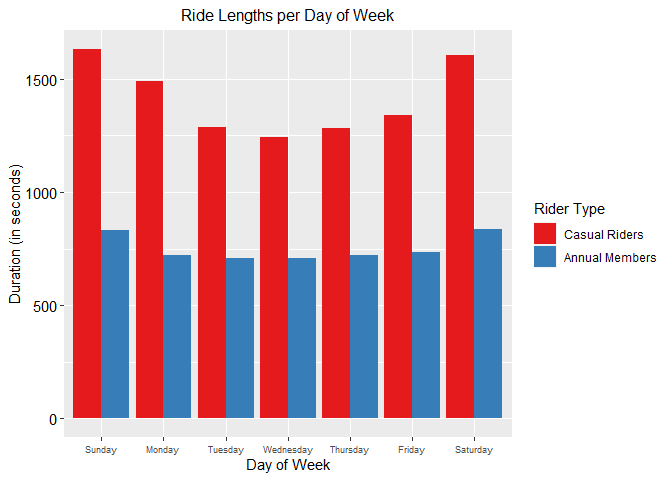
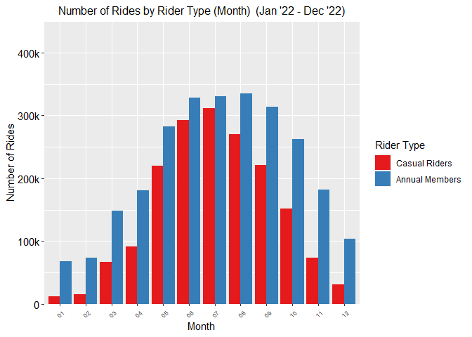
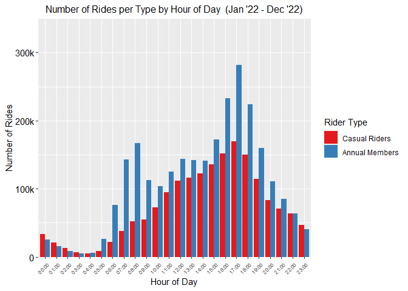
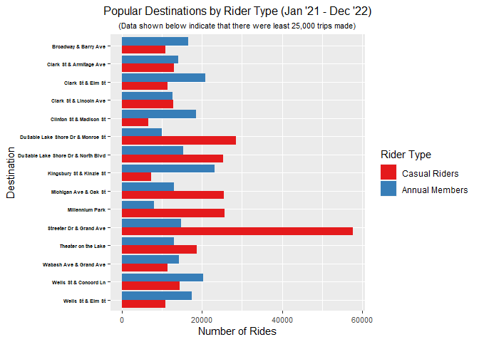

Cyclistic Bike Case Study
================
2023-01-27

## Introduction

The Cyclistic Bike Case Study is a capstone project of the Google Data
Analytics Professional Course that use 6 phases of Google Data Analysis:

1.  Ask
2.  Prepare
3.  Process
4.  Analyze
5.  Share
6.  Act

Cyclistic is a fictional bike sharing service company based in Chicago.
The Cyclistic team have recently concluded that annual memberships are
more profitable than casual riders. Lily Moreno, the director of
marketing, believes that maximizing the number of annual members will be
key to future growth. The objective of this project is to create
solutions to convert casual riders into annual members through
understanding the differences between annual members and casual riders.
The data has been made available by Motivate International Inc. in this
link <https://divvybikes.com/system-data>.

This RMarkdown file will focus on the Prepare, Process, Analyze, and
Share phases with RStudio

Click here <https://github.com/MichaelLorentiusHalim/Cyclistic_Bike-share_Capstone_Project/blob/6623a2da7495bb74ab3a065bb2d5f81b514d3228/Cyclistic%20bike-share.pptx> to find the final presentation of the case study in pptx.

## 1. Load the Libraries

We are assuming that all the packages has been installed in RStudio
before loading the libraries.

``` r
library(tidyverse)
library(readxl) 
library(lubridate)  
library(dplyr) 
library(ggplot2)  
library(knitr)
```

## 2. Process and Combine Datasets

### 2.1 Load the data

The data loaded is based on the divvy trip data of year 2022. The CSV
files were pre-modified in Excel to add additional columns ride_length
(the length of each ride) and day_of_week (the numerical value note that
1 = Sunday and 7 = Saturday).

``` r
Jan_22 <- read_excel("D:\\Data Analyst\\Case Study Cyclistic bikes\\Trip Data All Year 2022\\202201-divvy-tripdata.xlsx")
Feb_22 <- read_excel("D:\\Data Analyst\\Case Study Cyclistic bikes\\Trip Data All Year 2022\\202202-divvy-tripdata.xlsx")
Mar_22 <- read_excel("D:\\Data Analyst\\Case Study Cyclistic bikes\\Trip Data All Year 2022\\202203-divvy-tripdata.xlsx")
Apr_22 <- read_excel("D:\\Data Analyst\\Case Study Cyclistic bikes\\Trip Data All Year 2022\\202204-divvy-tripdata.xlsx")
May_22 <- read_excel("D:\\Data Analyst\\Case Study Cyclistic bikes\\Trip Data All Year 2022\\202205-divvy-tripdata.xlsx")
Jun_22 <- read_excel("D:\\Data Analyst\\Case Study Cyclistic bikes\\Trip Data All Year 2022\\202206-divvy-tripdata.xlsx")
Jul_22 <- read_excel("D:\\Data Analyst\\Case Study Cyclistic bikes\\Trip Data All Year 2022\\202207-divvy-tripdata.xlsx")
Aug_22 <- read_excel("D:\\Data Analyst\\Case Study Cyclistic bikes\\Trip Data All Year 2022\\202208-divvy-tripdata.xlsx")
Sep_22 <- read_excel("D:\\Data Analyst\\Case Study Cyclistic bikes\\Trip Data All Year 2022\\202209-divvy-tripdata.xlsx")
Oct_22 <- read_excel("D:\\Data Analyst\\Case Study Cyclistic bikes\\Trip Data All Year 2022\\202210-divvy-tripdata.xlsx")
Nov_22 <- read_excel("D:\\Data Analyst\\Case Study Cyclistic bikes\\Trip Data All Year 2022\\202211-divvy-tripdata.xlsx")
Dec_22 <- read_excel("D:\\Data Analyst\\Case Study Cyclistic bikes\\Trip Data All Year 2022\\202212-divvy-tripdata.xlsx")
```

### 2.2 Check the datasets for any inconsistency

We use the str(dataset) to make sure that all the data types in each
column are correct.

(*We have tested one dataset below to show that it has been verified in
RStudio*).

``` r
str(Jan_22)
```

    ## tibble [103,770 × 15] (S3: tbl_df/tbl/data.frame)
    ##  $ ride_id           : chr [1:103770] "C2F7DD78E82EC875" "A6CF8980A652D272" "BD0F91DFF741C66D" "CBB80ED419105406" ...
    ##  $ rideable_type     : chr [1:103770] "electric_bike" "electric_bike" "classic_bike" "classic_bike" ...
    ##  $ started_at        : POSIXct[1:103770], format: "2022-01-13 11:59:47" "2022-01-10 08:41:56" ...
    ##  $ ended_at          : POSIXct[1:103770], format: "2022-01-13 12:02:44" "2022-01-10 08:46:17" ...
    ##  $ start_station_name: chr [1:103770] "Glenwood Ave & Touhy Ave" "Glenwood Ave & Touhy Ave" "Sheffield Ave & Fullerton Ave" "Clark St & Bryn Mawr Ave" ...
    ##  $ start_station_id  : chr [1:103770] "525.0" "525.0" "TA1306000016" "KA1504000151" ...
    ##  $ end_station_name  : chr [1:103770] "Clark St & Touhy Ave" "Clark St & Touhy Ave" "Greenview Ave & Fullerton Ave" "Paulina St & Montrose Ave" ...
    ##  $ end_station_id    : chr [1:103770] "RP-007" "RP-007" "TA1307000001" "TA1309000021" ...
    ##  $ start_lat         : num [1:103770] 42 42 41.9 42 41.9 ...
    ##  $ start_lng         : num [1:103770] -87.7 -87.7 -87.7 -87.7 -87.6 ...
    ##  $ end_lat           : num [1:103770] 42 42 41.9 42 41.9 ...
    ##  $ end_lng           : num [1:103770] -87.7 -87.7 -87.7 -87.7 -87.6 ...
    ##  $ member_casual     : chr [1:103770] "casual" "casual" "member" "casual" ...
    ##  $ ride_length       : POSIXct[1:103770], format: "1899-12-31 00:02:57" "1899-12-31 00:04:21" ...
    ##  $ day_of_week       : num [1:103770] 5 2 3 3 5 3 1 7 2 6 ...

### 2.3 Changing the string types

The dataset of Sep_22 showed that the start_station_id and
end_station_id columns as *int* string types instead of *chr* string
types. All of the string types need to be the same prior to merging all
the datasets.

``` r
# Sep_22
Sep_22 <- mutate(
  Sep_22, 
  start_station_id = as.character(start_station_id),
  end_station_id = as.character(end_station_id)
)
```

### 2.4 Merge the datasets

``` r
all_trips <- bind_rows(Jan_22,Feb_22,Mar_22,Apr_22,May_22,Jun_22,Jul_22,Aug_22,
                       Sep_22,Oct_22,Nov_22,Dec_22)
```

## 3. Preparing the Dataset

### 3.1 Inspect the new dataset

We do a quick check on the newly merged dataset.

``` r
colnames(all_trips)  
nrow(all_trips) 
dim(all_trips)  
head(all_trips)
str(all_trips) 
summary(all_trips) 
```

### 3.2 Change the date string type and arrange the order

We are changing the columns of started_at and ended_at from a ‘chr’
string type to a date string type to make the analysis easier. The date
order is also arranged.

``` r
 all_trips$started_at <- as.POSIXct(
  all_trips$started_at, 
  format = "%Y-%m-%d %H:%M:%S"
)

all_trips$ended_at <- as.POSIXct(
  all_trips$ended_at, 
  format = "%Y-%m-%d %H:%M:%S")

# Change order by date
all_trips <- all_trips %>%
  arrange(started_at)
```

### 3.3 Convert the ride length

By converting the “ride_length” string type to numeric, we can now run
calculations on the data.

``` r
all_trips$ride_length <- difftime(
  all_trips$ended_at, 
  all_trips$started_at,
  units = "secs"
) 

# Change string type to numeric 
all_trips$ride_length <- as.numeric(
  as.character(all_trips$ride_length)
)
```

### 3.4 Create separate columns for additional data

We create separate columns for year, month, day of week etc. to help
analyze the data in an easier format.

``` r
# Year 
all_trips$year <- format(
  all_trips$started_at, 
  "%Y"
)

# Month 
all_trips$month <- format(
  all_trips$started_at, 
  "%m"
)

# Week 
all_trips$week <- format(
  all_trips$started_at,
  "%W"
)

# Day
all_trips$day <- format(
  all_trips$started_at, 
  "%d"
)

# Day of week 
all_trips$day_of_week <- format(
  all_trips$started_at, 
  "%A"
)

# Date, YYYY-MM-DD
all_trips$YMD <- format(
  all_trips$started_at, 
  "%Y-%m-%d"
)

# Time of Day, HH:MM:SS
all_trips$ToD <- format(
  all_trips$started_at, 
  "%H:%M:%S"
)
```

## 4. Clean the dataset

### 4.1 Removing rows in ride length with value \< 0

We found out that there were several invalid data where the ride lengths
\< 0. Removing it will help us create a cleaner data.

``` r
# Remove ride lengths < 0
all_trips_cleaned <- all_trips %>%
  filter(!(ride_length < 0))
```

### 4.2 Removing incomplete rows

There were several blank data found in start_station_name and
end_station_name. We will remove the incomplete rows.

``` r
all_trips_cleaned <- all_trips_cleaned %>%
  filter(
    !(is.na(start_station_name) |
        start_station_name == "")
  ) %>% 
  
  filter(
    !(is.na(end_station_name) |
        end_station_name == "")
  )
```

### 4.3 Removing duplicates

Checking the ride_id column for any duplicate that might exist.

``` r
ride_id_check <- all_trips_cleaned %>%
  count(ride_id) %>%
  filter(n > 1)
```

## 5. Perform Descriptive Analysis

### 5.1 Compare annual members and casual riders

We will compare the mean, median, max, and min of each type of rider by
aggregating it.

``` r
aggregate(all_trips_cleaned$ride_length ~ all_trips_cleaned$member_casual, FUN = mean)
```

    ##   all_trips_cleaned$member_casual all_trips_cleaned$ride_length
    ## 1                          casual                     1439.5858
    ## 2                          member                      747.1038

``` r
aggregate(all_trips_cleaned$ride_length ~ all_trips_cleaned$member_casual, FUN = median)
```

    ##   all_trips_cleaned$member_casual all_trips_cleaned$ride_length
    ## 1                          casual                           831
    ## 2                          member                           539

``` r
aggregate(all_trips_cleaned$ride_length ~ all_trips_cleaned$member_casual, FUN = max)
```

    ##   all_trips_cleaned$member_casual all_trips_cleaned$ride_length
    ## 1                          casual                       2061244
    ## 2                          member                         89594

``` r
aggregate(all_trips_cleaned$ride_length ~ all_trips_cleaned$member_casual, FUN = min)
```

    ##   all_trips_cleaned$member_casual all_trips_cleaned$ride_length
    ## 1                          casual                             0
    ## 2                          member                             0

### 5.2 Average ride lengths per rider type sorted by weekday

``` r
aggregate(all_trips_cleaned$ride_length ~ all_trips_cleaned$member_casual + all_trips_cleaned$day_of_week, FUN = mean)
```

    ##    all_trips_cleaned$member_casual all_trips_cleaned$day_of_week
    ## 1                           casual                        Friday
    ## 2                           member                        Friday
    ## 3                           casual                        Monday
    ## 4                           member                        Monday
    ## 5                           casual                      Saturday
    ## 6                           member                      Saturday
    ## 7                           casual                        Sunday
    ## 8                           member                        Sunday
    ## 9                           casual                      Thursday
    ## 10                          member                      Thursday
    ## 11                          casual                       Tuesday
    ## 12                          member                       Tuesday
    ## 13                          casual                     Wednesday
    ## 14                          member                     Wednesday
    ##    all_trips_cleaned$ride_length
    ## 1                      1341.4274
    ## 2                       733.6176
    ## 3                      1490.0468
    ## 4                       721.9727
    ## 5                      1605.9639
    ## 6                       838.8955
    ## 7                      1633.6491
    ## 8                       831.0426
    ## 9                      1284.2069
    ## 10                      721.9124
    ## 11                     1286.5190
    ## 12                      707.4679
    ## 13                     1243.0783
    ## 14                      710.8143

By finding the mean of ride lengths by weekday, we discover that casual
riders ride longer than annual members.

### 5.2 Number of rides for each type by weekday

``` r
all_trips_cleaned %>% 
  group_by(member_casual, day_of_week) %>%  
  summarise(number_of_rides = n()                           
            ,average_duration = mean(ride_length)) %>%      
  arrange(member_casual, day_of_week)
```

    ## `summarise()` has grouped output by 'member_casual'. You can override using the
    ## `.groups` argument.

    ## # A tibble: 14 × 4
    ## # Groups:   member_casual [2]
    ##    member_casual day_of_week number_of_rides average_duration
    ##    <chr>         <chr>                 <int>            <dbl>
    ##  1 casual        Friday               248796            1341.
    ##  2 casual        Monday               210757            1490.
    ##  3 casual        Saturday             367340            1606.
    ##  4 casual        Sunday               301296            1634.
    ##  5 casual        Thursday             230005            1284.
    ##  6 casual        Tuesday              196380            1287.
    ##  7 casual        Wednesday            203576            1243.
    ##  8 member        Friday               360052             734.
    ##  9 member        Monday               375168             722.
    ## 10 member        Saturday             338273             839.
    ## 11 member        Sunday               297721             831.
    ## 12 member        Thursday             415886             722.
    ## 13 member        Tuesday              411242             707.
    ## 14 member        Wednesday            412794             711.

Eventhough, the number casual riders were larger during the weekends,
the annual members seem to take more rides during the weekdays. This may
implies that many annual members use bike to commute to work every
weekdays.

### 5.3 Rideable types chosen by both riders

``` r
all_trips_cleaned %>% 
  group_by(member_casual, rideable_type) %>%  
  summarise(number_of_rides = n()                           
            ,average_duration = mean(ride_length)) %>%      
  arrange(member_casual, rideable_type)
```

    ## `summarise()` has grouped output by 'member_casual'. You can override using the
    ## `.groups` argument.

    ## # A tibble: 5 × 4
    ## # Groups:   member_casual [2]
    ##   member_casual rideable_type number_of_rides average_duration
    ##   <chr>         <chr>                   <int>            <dbl>
    ## 1 casual        classic_bike           888764            1467.
    ## 2 casual        docked_bike            174858            3042.
    ## 3 casual        electric_bike          694528            1001.
    ## 4 member        classic_bike          1708632             794.
    ## 5 member        electric_bike          902504             658.

Here we can see which type of bike is chosen by each rider. Classic and
electric bikes are more popular than docked bikes.

## 6. Data Visualization

### 6.1 Visualization - Number of rides by rider type (Day of Week)

The graph below indicate that there were roughly the same number of
rides between both rider on the weekends and more annual members during
the weekdays.

``` r
member_casual_new <- as_labeller(c(`member`= "Annual Members", `casual`= "Casual Riders")
)
all_trips_cleaned %>% 
  group_by(member_casual, day_of_week) %>% 
  summarise(average_duration = mean(ride_length)) %>% 
  arrange(member_casual, day_of_week)  %>% 
  ggplot(aes(x = factor(day_of_week, levels = c('Sunday','Monday','Tuesday','Wednesday','Thursday','Friday','Saturday')), y = average_duration, fill = member_casual)) +
  geom_col(position = "dodge") +
  labs(
    x="Day of Week", 
    y="Duration (in seconds)",
    fill = "Rider Type",
    title = "Ride Lengths per Day of Week", 
  ) +
  theme(
    axis.text.x = element_text(size = 7),
    axis.text.y = element_text(size = 11, color = "Black"),
    plot.title = element_text(size = 12, hjust = 0.5)
  ) +
  scale_fill_brewer(palette = "Set1" , labels = member_casual_new)
```

    ## `summarise()` has grouped output by 'member_casual'. You can override using the
    ## `.groups` argument.

<!-- -->

### 6.2 Visualization - Average ride lengths by rider type (Day of Week)

The graph below show that casual riders take longer rides than annual
members.

``` r
#Visualization of Average Ride Lengths (Day of Week)
all_trips_cleaned %>% 
  group_by(member_casual, day_of_week) %>% 
  summarise(average_duration = mean(ride_length)) %>% 
  arrange(member_casual, day_of_week)  %>% 
  ggplot(aes(x = factor(day_of_week, levels = c('Sunday','Monday','Tuesday','Wednesday','Thursday','Friday','Saturday')), y = average_duration, fill = member_casual)) +
  geom_col(position = "dodge") +
  labs(
    x="Day of Week", 
    y="Duration (in seconds)",
    fill = "Rider Type",
    title = "Ride Lengths per Day of Week", 
  ) +
  theme(
    axis.text.x = element_text(size = 7),
    axis.text.y = element_text(size = 11, color = "Black"),
    plot.title = element_text(size = 12, hjust = 0.5)
  ) +
  scale_fill_brewer(palette = "Set1" , labels = member_casual_new)
```

    ## `summarise()` has grouped output by 'member_casual'. You can override using the
    ## `.groups` argument.

<!-- -->

### 6.3 Visualization - Average ride lengths by rider type (Month)

Below is the graph of number of rides by rider type (Month).We can see
that the number of rides increased from May 2022 to September 2022 and
drastic decreases on January, February, and December of 2022.

``` r
# Visualization of number of rides by rider type (Month)
  all_trips_cleaned %>% 
  group_by(member_casual, month) %>% 
  summarise(number_of_rides = n()) %>% 
  arrange(member_casual, month)  %>% 
  ggplot(aes(x = factor(month), y = number_of_rides, fill = member_casual)) +
  geom_col(position = "dodge") +
  labs(
    x="Month", 
    y="Number of Rides",
    fill = "Rider Type",
    title = "Number of Rides by Rider Type (Month)  (Jan '22 - Dec '22)", 
  ) +
  theme(
    axis.text.x = element_text(size = 7, angle = 45, vjust = 1, hjust = 1),
    axis.text.y = element_text(size = 11, color = "Black"),
    plot.title = element_text(size = 12, hjust = 0.5)
  ) +
  scale_y_continuous(expand = c(0, 0),  limits = c(0, 450000), labels = c("0", "100k", "200k", "300k", "400k")) +
  scale_fill_brewer(palette = "Set1" , labels = member_casual_new)
```

    ## `summarise()` has grouped output by 'member_casual'. You can override using the
    ## `.groups` argument.

<!-- -->

### 6.4 Visualization - Rides per hour by rider type

As shown in the graph below, the annual members show more number of
rides from 6:00 to 20:00, which further verify that they use bikes to
commute to work.

``` r
all_trips_cleaned$start_hour <- strftime(all_trips_cleaned$started_at, format = '%H:00', tz = 'UTC', usetz = FALSE)
#
order_hours <- c('0:00', '1:00', '2:00', '3:00', '4:00', '5:00', '6:00', '7:00', '8:00'
                 , '9:00', '10:00', '11:00', '12:00', '13:00', '14:00', '15:00', '16:00'
                 , '17:00', '18:00', '19:00', '20:00', '21:00', '22:00', '23:00')
all_trips_cleaned %>% 
  group_by(member_casual, start_hour) %>% 
  summarise(number_of_rides = n()) %>%
  arrange(member_casual, start_hour) %>% 
  ggplot(aes(x = start_hour, y = number_of_rides, fill = member_casual)) +
  geom_col(position = "dodge") +
  labs(
    x="Hour of Day", 
    y="Number of Rides",
    fill = "Rider Type",
    title = "Number of Rides per Type by Hour of Day  (Jan '22 - Dec '22)", 
  ) +
  theme(
    axis.text.x = element_text(size = 7, angle = 45, vjust = 1, hjust = 1),
    axis.text.y = element_text(size = 11, color = "Black"),
    plot.title = element_text(size = 12, hjust = 0.5)
  ) +
  scale_y_continuous(expand = c(0, 0),  limits = c(0, 350000), labels = c("0", "100k", "200k", "300k", "400k")) +
  scale_fill_brewer(palette = "Set1" , labels = member_casual_new)
```

    ## `summarise()` has grouped output by 'member_casual'. You can override using the
    ## `.groups` argument.

<!-- -->

### 6.5 Visualization - Popular destinations by rider type

It can be seen that most of these destinations were frequently visited
by annual members. However, some stations like Streeter Dr & Grand Ave
were visited more by casual riders.

This graph show that casual riders may consist of tourists that use bike
to visit popular tourist destinations, most being close to Lake
Michigan, Navy Pier, or Millenial Park and that most annual members may
be locals in Chicago.

``` r
# Visualizing popular destinations 
trip_destinations <- all_trips_cleaned %>% 
  group_by(start_station_name, end_station_name, member_casual) %>%  
  summarise(num_rides_per_ridetype = n()) %>%   
  add_count(end_station_name, wt = num_rides_per_ridetype, name = 'num_rides_total') %>%
  ungroup() %>%
  group_by(member_casual, end_station_name) %>%
  add_count(end_station_name, wt = num_rides_per_ridetype, name = 'destination_total_per_ridetype') %>%
  ungroup() %>%
  add_count(end_station_name, wt = num_rides_per_ridetype, name = 'destination_total') %>%
  arrange(start_station_name, end_station_name, member_casual)
```

    ## `summarise()` has grouped output by 'start_station_name', 'end_station_name'.
    ## You can override using the `.groups` argument.

``` r
condition <- ((is.na(trip_destinations$end_station_name)) | (trip_destinations$destination_total < 25000))

trip_destinations[!condition,] %>%
  ggplot(aes(y = reorder(end_station_name, desc(end_station_name)), x = destination_total_per_ridetype, fill = member_casual)) +
  geom_col(position = "dodge") +
  #facet_wrap(~member_casual, labeller = member_casual_new) +
  labs(
    x="Number of Rides", 
    y="Destination",
    fill = "Rider Type",
    title="Popular Destinations by Rider Type (Jan '21 - Dec '22)", 
    subtitle="(Data shown below indicate that there were least 25,000 trips made)"
  ) +
  theme(
    axis.text.x = element_text(size = 8),
    axis.text.y = element_text(size = 5, color = "Black", face = "bold"),
    plot.title = element_text(size = 12, hjust = 0.5),
    plot.subtitle = element_text(size = 8, hjust = 0.5)
  ) +
  scale_fill_brewer(palette = "Set1" , labels = member_casual_new)
```

<!-- -->

## 7. Recommendation

##### Based on my analysis, here are my 3 recommendations to help Cyclistic convert casual riders to annual members:

1.  Create notifications/email reminders for casual riders to understand
    the benefits of being annual members. A new membership promotion
    might help to make casual riders be interested in signing in as
    annual members.
2.  Digital campaign that show testimonies about how being an annual
    member is more beneficial than casual rider. Digital advertisement
    during the high season can also be targeted for casual riders or
    tourists that prefer to go to popular destinations in Chicago.
3.  Adding a reward system to the annual membership. By visiting certain
    stations or tourist spot, annual members can get points that can be
    exchanged for gifts or foods. This system might help bring casual
    riders to become annual members to gain interesting rewards.
